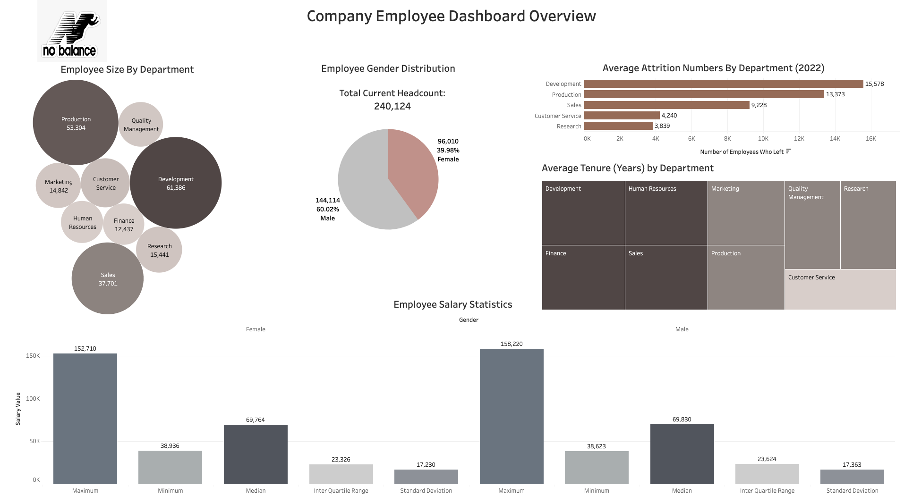
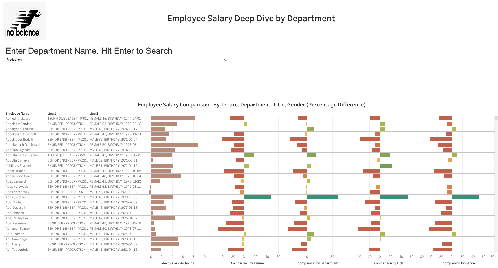

# HR Analytics Dashboard

 

**Note that employee details are fake and were created for the purpose of demonstrating the visualisation.**

The dashboard has been split into 2 parts:
- An Overview which you can find [here](https://public.tableau.com/app/profile/karen.lee4168/viz/HRAnalyticsDashboardOverview/EmployeeOverview) and 
- An employee salary deep dive which you can find [here](https://public.tableau.com/app/profile/karen.lee4168/viz/HRAnalyticsEmployeeSalaryDeepDive/EmployeeSalaryDeepDiveDashboard)

 

The employee salary deep dive allows the user to search by any of the 9 departments within the NoBalance company (Production, Development, Customer Service, Finance, Quality Management, Research, Sales, Marketing and Human Resources) and to compare an employee's current salary against the company's benchmarks. These benchmarks are:
- Gender
- Department
- Title
- Tenure
